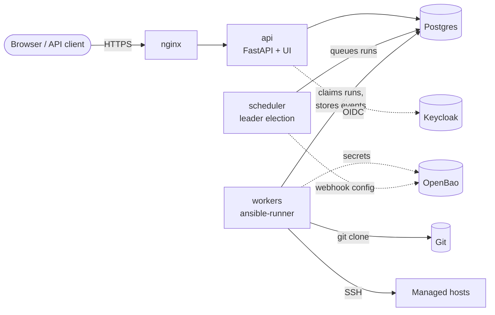

<p align="center">
  <picture>
    <source media="(prefers-color-scheme: dark)" srcset="docs/logos/lamplighter-logo-dark.svg">
    
  </picture>
</p>

<p align="center">
  <strong>Runs your Ansible playbooks on a schedule and on demand, with live logs and full history.</strong>
</p>

<p align="center">
  <a href="https://github.com/michaelhuisman/lamplighter/actions/workflows/ci.yml"></a>
  
  
  <a href="https://github.com/michaelhuisman/lamplighter/pkgs/container/lamplighter"></a>
  <a href="LICENSE"></a>
</p>

---

lamplighter takes playbooks straight from Git and runs them: every night at two, every
five minutes, or right now at the push of a button. You follow the output live in the
browser, and afterwards every run is still there, with its commit, its parameters and its
per-host results. Secrets stay in OpenBao; lamplighter only stores references to them.

It is deliberately small: one container image, Postgres as the only state store, and no
Redis, message broker or Kubernetes required.

## Features

- **Schedules with real cron semantics.** Five-field cron per schedule with its own time
  zone. It follows Vixie cron around daylight saving time, so a job at `30 2 * * *` fires
  once, not twice, in autumn.
- **Overlap control.** Per schedule, choose `skip` (a new firing is skipped while the
  previous run is still going) or `queue` (it waits its turn).
- **Live logs.** Output streams to the browser via Server-Sent Events and survives
  reconnects. `no_log` output and known secret values are filtered out before anything is
  stored.
- **Run history.** Status, return code, the git commit that ran, the effective extra vars
  and per-host stats (ok, changed, failed, unreachable, …).
- **Secrets from OpenBao.** SSH keys, vault passwords, git tokens, `known_hosts` and
  webhook URLs are fetched just in time with AppRole. Nothing secret ends up in the
  database, the logs or the run events.
- **Sign-in your way.** Local users (argon2id, lockout) and/or Keycloak via OIDC with
  PKCE. Three roles: `viewer`, `operator` (launch and cancel) and `admin`. Every change is
  in the audit log.
- **API first.** A REST API with personal API tokens; the web UI uses the same schemas.
- **Built for failure.** Several workers and scheduler replicas can run side by side:
  queue claims use `SKIP LOCKED` and leader election uses a Postgres advisory lock. A
  crashed worker's runs are cleaned up automatically.
- **Observable.** Prometheus metrics (runs per status, durations, queue depth, last
  successful run per schedule, backup and retention status) and signed webhooks on
  failures.
- **Easy to operate.** An Ansible role installs or updates it with one command, updates
  never interrupt a running playbook, and there are daily backups with a tested restore.

## How it works



One image, three roles: `api` (REST API, web UI, live logs), `scheduler` (turns schedules
into queued runs; exactly one replica is the leader) and `worker` (checks out the repo and
runs `ansible-runner`). A one-shot `migrate` container keeps the schema up to date.

## Installation

The supported way to run lamplighter in production is the Ansible role in
[`deploy/`](deploy/). It deploys the stack with Docker Compose on a single Linux host.

### Requirements

- A Linux VM with **Docker Engine and the compose plugin** (`docker compose version`) and
  **systemd**. The OS doesn't matter; the role does not install Docker for you.
- A **reverse proxy for TLS** on that host, e.g. the nginx you already have. An example
  config is in [`docs/deploy/nginx.conf`](docs/deploy/nginx.conf).
- **OpenBao** (or Vault) for the credentials that playbooks use.
- Optional: **Keycloak** (or another OIDC provider) for single sign-on.
- On your own machine: Python 3.12+ with `ansible-core`.

### 1. Prepare OpenBao

lamplighter reads from a KV v2 mount (`secret` by default), with two AppRoles that follow
least privilege:

```bash
bao policy write lamplighter-worker - <<'EOF'
path "secret/data/ssh/*"   { capabilities = ["read"] }
path "secret/data/vault/*" { capabilities = ["read"] }
path "secret/data/git/*"   { capabilities = ["read"] }
EOF
bao policy write lamplighter-scheduler - <<'EOF'
path "secret/data/webhooks/*" { capabilities = ["read"] }
EOF

bao auth enable approle
bao write auth/approle/role/lamplighter-worker token_policies=lamplighter-worker token_ttl=15m token_max_ttl=1h
bao write auth/approle/role/lamplighter-scheduler token_policies=lamplighter-scheduler token_ttl=15m token_max_ttl=1h

bao read -field=role_id auth/approle/role/lamplighter-worker/role-id
bao write -f -field=secret_id auth/approle/role/lamplighter-worker/secret-id
# ...and the same for lamplighter-scheduler
```

Where secrets live:

| Path | Content | Used for |
|---|---|---|
| `ssh/<name>` | SSH private key, or `known_hosts` | machine credentials, host key checking |
| `vault/<name>` | Ansible Vault password | vault credentials |
| `git/<name>` | token (+ optional `username`) | private Git repos over https |
| `webhooks/<name>` | `urls` (JSON list), optional `hmac_secret` | failure notifications |

### 2. Optional: Keycloak

Create a confidential client `lamplighter` with the standard flow and PKCE (S256), the
redirect URI `https://<your-host>/ui/auth/callback`, and client roles `viewer`, `operator`
and `admin`. Map the client to the `aud` claim of access tokens with an audience mapper.
Set "Valid post logout redirect URIs" to `https://<your-host>/ui/login*`: "Sign out" in
lamplighter then also ends the Keycloak session, and Keycloak sends you back to the login
page.

### 3. Configure the deployment

```bash
git clone https://github.com/michaelhuisman/lamplighter.git
cd lamplighter/deploy
pip install -r requirements.txt
ansible-galaxy collection install -r requirements.yml

cp -r inventory/example ~/lamplighter-inventory         # keep your inventory outside the repo
cd ~/lamplighter-inventory
$EDITOR hosts.yml group_vars/lamplighter/main.yml
cp group_vars/lamplighter/vault.yml.example group_vars/lamplighter/vault.yml
$EDITOR group_vars/lamplighter/vault.yml                 # e.g. openssl rand -hex 32
ansible-vault encrypt group_vars/lamplighter/vault.yml
```

The most important variables (all of them are in
[`defaults/main.yml`](deploy/roles/lamplighter/defaults/main.yml)):

| Variable | Meaning |
|---|---|
| `lamplighter_image_tag` | image to deploy: the full git SHA of a `main` build (required) |
| `lamplighter_public_url` | public URL, used for links and the OIDC redirect (required) |
| `lamplighter_postgres_password` | database password (required, from vault) |
| `lamplighter_openbao_addr` + four AppRole ids | OpenBao |
| `lamplighter_oidc_issuer`, `lamplighter_oidc_client_secret` | Keycloak (optional) |
| `lamplighter_metrics_token` | bearer token for `/metrics` |
| `lamplighter_settings` | any other setting, e.g. `{retention_runs_days: 365}` |
| `lamplighter_backup_time`, `lamplighter_backup_keep_days` | daily backup |

### 4. Deploy

Pick an image from the
[container registry](https://github.com/michaelhuisman/lamplighter/pkgs/container/lamplighter):
every build of `main` is tagged with its full git SHA.

```bash
cd lamplighter/deploy
ansible-playbook site.yml -i ~/lamplighter-inventory/hosts.yml --ask-vault-pass \
    -e lamplighter_image_tag=<git-sha>
```

The role puts everything in `/opt/lamplighter`, runs the database migrations, starts
the stack, installs the backup timer and waits until the API is ready. Running it again
changes nothing.

### 5. Put nginx in front and create the first admin

Adapt [`docs/deploy/nginx.conf`](docs/deploy/nginx.conf) and reload nginx. Then, on the
host:

```bash
cd /opt/lamplighter
sudo docker compose run --rm --no-deps api create-user admin --role admin   # asks for a password
```

Sign in at `https://<your-host>/ui`, add a project (Git repo), an inventory, credentials
(references to OpenBao) and a template, and launch your first run.

### Updating

Run the same playbook with a newer tag:

```bash
ansible-playbook site.yml -i ~/lamplighter-inventory/hosts.yml --ask-vault-pass \
    -e lamplighter_image_tag=<new-git-sha>
```

The migrations run first, then api and scheduler are replaced, and the two workers are
updated one after the other. A worker that is busy finishes its playbook before it is
replaced (at most `lamplighter_worker_stop_grace`, 1 hour by default), while the other
worker keeps picking up runs. Running playbooks are never interrupted.

### Backup and restore

A daily `pg_dump` runs from a systemd timer; the dumps are in `/opt/lamplighter/backups`.
Restore one with:

```bash
ansible-playbook restore.yml -i ~/lamplighter-inventory/hosts.yml --ask-vault-pass \
    -e lamplighter_restore_file=lamplighter-<timestamp>.dump
```

See [`docs/deploy/restore.md`](docs/deploy/restore.md) for offsite copies, alerts and the
manual procedure.

### Monitoring

`/metrics` (with `Authorization: Bearer <lamplighter_metrics_token>`) exposes, among
others:

- `lamplighter_runs_total{template,status}` and `lamplighter_run_duration_seconds`
- `lamplighter_queue_depth` and `lamplighter_runs_running`
- `lamplighter_schedule_last_success_timestamp_seconds{schedule_id,template}`
- `lamplighter_maintenance_last_success_timestamp_seconds{task}` for `backup` and `retention`

`/healthz` (liveness) and `/readyz` (database reachable) are there for health checks.

## Ansible collections

The image comes with `ansible-core` and a small standard set of collections, pinned in
[`collections/requirements.yml`](collections/requirements.yml): `ansible.posix` and
`community.general`. Every playbook can use these.

A project can bring its own collections, the same way AWX does: put a
`collections/requirements.yml` in the root of its Git repo.

```yaml
# <your-repo>/collections/requirements.yml
collections:
  - name: community.docker
    version: 5.3.0          # pin versions: the cache is per requirements file
  - name: community.general
    version: 12.0.0         # overrides the image's version for this project
```

Before a run, the worker installs these with `ansible-galaxy` into a shared cache (one
directory per unique `collections/` content). Only the first run waits; the run log shows
a line like "Collections from collections/requirements.yml: cached". A project's
collections come before the standard set, so a project can use a different version. If
the installation fails, the run ends as `error` with the reason.

- The worker needs access to `galaxy.ansible.com` (or the source in your requirements).
  Behind a proxy, set `lamplighter_https_proxy` (and `lamplighter_no_proxy` for internal
  hosts such as OpenBao) in the Ansible role.
- Collections run code on the worker, just like the playbooks in the same repo. Only use
  sources you trust, and pin versions.
- Collections vendored in `collections/ansible_collections/` of the repo work as well
  (ansible-core finds them next to the playbook).
- Unused cache entries are removed after 30 days (`LAMPLIGHTER_COLLECTIONS_CACHE_DAYS`).

## Development

Everything runs in containers; you don't need Python 3.12 locally. The project uses
Podman (Docker works too).

```bash
scripts/dev-keys.sh                                   # generate dev secrets in .dev/ (once)
podman compose -f compose.dev.yml up -d --build --scale worker=2 --scale scheduler=2
podman compose -f compose.dev.yml run --rm dev python -m app create-user admin --role admin
open http://localhost:8000/ui
```

The dev stack includes Postgres, an SSH target to run playbooks against, Keycloak,
OpenBao, a Git server and a webhook receiver. Tests and linters:

```bash
DEV="podman compose -f compose.dev.yml run --rm dev"
$DEV sh -c 'ruff check . && ruff format --check . && mypy app'
$DEV pytest tests/unit
$DEV pytest tests/integration
```

The design, the phasing and the open items are in [`docs/plan.md`](docs/plan.md).
Conventions for contributors (and for AI assistants) are in [`CLAUDE.md`](CLAUDE.md).

CI (GitHub Actions) runs the linters, the unit and integration tests, a full deploy test
of the Ansible role, and a [Trivy](https://trivy.dev) scan of the image. Builds of `main`
and version tags are published to `ghcr.io/michaelhuisman/lamplighter`.

## License

[MIT](LICENSE) © Michael Huisman
